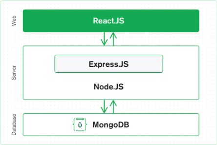

# AndrewDuggan_T3A1

# Q1 - Provide an overview and description of a standard source control process for a large project.

Source (or version) control is the tracking of changes with software. This allows multiple developers to work on the same code without unintentionally overwriting each other’s work.

The centralised workflow uses a central repository that serves as a focus for all changes to the project. The first developer downloads a copy of the source files; Once they have been uploaded, any attempt to uploaded files with the incorrect version number will be checked for conflicts before being accepted.

<!-- https://www.perforce.com/blog/vcs/what-source-control -->
<!-- https://www.atlassian.com/git/tutorials/comparing-workflows -->

# Q2 - What are the most important aspects of quality software?

<!-- CMP1043-2.2 - List discuss and demonstrate 6 software quality characteristics -->

## Functional Suitability

The functionality of software is from both the user and clients perspective, it includes making sure:

- the functions fulfil the requirements of the software,
- the software accurately depicts the withe clients of the client
- the software can interact with all required systems.
- unauthorised use is prevented and it is resistant to the manipulation of the software or modification of the stored data.

## Efficiency

The efficiency of the software is its ability to run at peak performance.

## Compatibility

The compatability of the software is its ability to communicate with other software without detriment to its efficiency

## Usability

The usability of the software is the degree that the end-user can navigate the software in an efficient and effective way and have an overall sasfactory experience with the software

## Reliability

The reliability of the software can be defined by its resistance to changes in the host system, tolerance to software faults and its ability to maintain an active program in the event of a fault and to have the ability to recover its data in the event of a catastrophic failure.

## Security

The security of software is its ability to prevent unauthorised and unwanted access.

## Maintainability

Maintainability is the ability of the software to be reworked and reused.

## Portability

The software must be able to work on multiple systems, with small adjustments.

<!-- [ISO/IEC 25010 (2011)](https://www.iso.org/obp/ui/#iso:std:iso-iec:25010:ed-1:v1:en) -->
<!-- https://www.springer.com/journal/11219 -->
<!-- Software Testing and Quality Assurance: Theory and Practice by Naik and Tripathy, 2008 -->
<!-- https://www2.cs.sfu.ca/~cameron/Teaching/473/quality_characteristics.html -->
<!-- https://en.wikipedia.org/wiki/Software_quality -->

# Q3 - Outline a standard high level structure for a MERN stack application and explain the components.

<!-- CMP1043-2.3 - Shows understanding of the high level structure of the app -->



## M - MongoDB

MongoDB is a database that stores data in a document-orientated, non-SQL database. It does not use schema formats like tables, columns, and rows. The data is formatted in the JavaScript Object Notation (JSON).

## E - Express Node

Express Node is a lightweight, modular framework of Node JS. It is used as a server side (Back end) framework, it simplifies the building of mobile/web applications and API's.

## R - React

React is a front-end (client side) JavaScript framework/library for creating views in HTML that was created by Facebook. Its biggest advantage is the ability to refresh components of the website without having to refresh the entire page.

## N - NodeJS

Node.js is a cross-platform JavaScript runtime environment that allows JavaScript code outside of a Web Browser. Using npm, the developer can choose from thousands of packages (similar to gems in Ruby).

<!-- https://en.wikipedia.org/wiki/Node.js -->
<!-- https://www.mongodb.com/mern-stack -->
<!-- https://www.npmjs.com/ -->

# Q4 - A team is about to engage in a project, developing a website for a small business. What knowledge and skills would they need in order to develop the project

<!-- CMP1043-3.1 describes a range of skills and knowledge required by IT workers to complete a quality web development project -->

## Planning and Project Management

- Communication Skills, includes ability to interpret the clients withe clients, the ability to put forward their ideas and experience to guide the client and the ability to discuss the roles and tasks within the team.
- The team needs to have good time appreciation and management in order to give realistic timings and manage the clients expectations.
- The team needs to be able to operate the chosen project management software or hardware (from Post-It notes to Trello)
- Researching new information and policies are a constant when it comes to coding, the technology and languages change at a rapid rate.

## Hardware/Technology

- The team needs to be able to operate the hardware required for the coding (it is pointless to create an application that will work on a Mac when the team is unable to test it)
- Front-end development is required to enable users to access all of the features in an intuitive and efficient manner. The User Interface / User Experience (UI/UX) is essential for the end users satisfaction, this makes it essential skills for app development
- Back-end development is a very important skillset to have, as the range of database management systems exist, the team needs to have members skilled in the specific system.
- Quality assurance and performance testing skills are needed to test the software as the team should have set testing processes in place.
- The Security of the system (especially the back-end data) should be an essential part of the software. As the security requirements may change depending on which countries the software will be operating in, the security protocol skillset will be tested.
- The software can be written in many languages (Rails, React, etc) the knowledge and skill for the individual languages is essential over the entire team.

## Version control and Deployment

- The knowledge and skill required to use Version control software
- The knowledge and skill to use either in online deployment server or to manipulate the clients servers.

<!-- https://ascendle.com/ideas/14-skills-your-app-development-team-must-have/ -->
<!-- https://www.wrike.com/project-management-guide/faq/what-is-agile-methodology-in-project-management/ -->

# Q5 - With reference to one of your own projects, discuss what knowledge or skills were required to complete your project, and to overcome challenges.

<!-- CMP1043-3.2 describes a range of skills and knowledge used to complete a project. -->

The creation of my questionnaire application in rails required the application to be written in multiple languages.

## Planning and Project Management

- Communication Skills - In order to create this application, I was required to understand the clients withe clients and let her know what was and was not possible.
- Time appreciation and management was required because I had to deal with outside forces that were occupying my time (kids, power outages).
- I used a whiteboard to start the project planning and moved to Trello in order to allow the client to see where I was up to.
- Researching new information and policies are a constant when it comes to coding in languages that I have just started to learn.
- My problem solving and adaptability skills were tested during the creation

## Hardware/Technology

- Front-end development using HTML/CSS and a bit of JS. The User Interface / User Experience (UI/UX) stretched my coding abilities as it had to be aimed at users that had limited technological abilities.
- The Back-end development, through Rails and PostGRES, was needed to allow the users to access the questions, update their answers and view the finithe clientd database.
- Quality assurance and performance testing skills were essential as the client did not have a lot of time to invest in the application, though the client did test the app by doing things that I did not think anyone would ever do making me have to rethink the way I was coding.
- The Security of the system (especially the back-end data) was essential as the database contained personal information for the login, profile and questionairre. The security followed the Australian standards only as the application is for the use in Australia only. Reference was made in the code to ensure individual country standards are consulted before release overseas.

## Version control and Deployment

- Version control was achieved using GITHUB, being able to use it was a great skill
- Though it has been taken down, the app was deployed and live tested by Heroku, understanding the Heroku system was necessary.

# Q6 - With reference to one of your own projects, evaluate how effective your knowledge and skills were for this project, and suggest changes or improvements for future projects of a similar nature.

<!-- CMP1043-3.3 Evaluates effectiveness of knowledge and skills accurately, providing examples, and providing an insightful improvement on each skill -->

## Planning and Project Management

Communication Skills -I found that my communication skills were adequate; Unfortunately, as the client was a regested nurse, I found that many of her requests would not turn out as the client hoped, as what the client wanted was different to my interperation. An example of this was her request that the pages have a set background picture with clashing text colours in front (even with a wire diagram that the client did not understand). It turned out that her definition of a background image was an image that did not take focus from the main text, after completing the page and explaining that it would no look good. To improve this, I will allocate more time to the presentation of each page and ensure that I use the AGLIE method.

- My Time appreciation and management was horrendus, I underestimated the distraction caused by having the kids around. In the future, I need to either factor in extra time for the distractions or remove myself from the distractions.
- The Whiteboard was a good start and I will continue using one to start off with. I found that though my skills in setting up Trello for the team to use (myself in this instance) was exceptional, I had a difficult time remembering to update and move the cards once each portion was complete, I also found that I tended to chop and change tasks, often completing several tasks at the same time, this was not very efficient. I need to concentrate on one task at a time and complete them, update the board and move on.
- I found that my ablilty to research may be OK, but as there are many different sites that contain solutions for each problem, many of those sites contained outdated information. With experience, I will be able to differentiate between the two.
- My problem solving and adaptability skills were tested during the creation of the app, though I was able to solve all of the problems that came up, I tended to spend too much time on each problem. In the future I need to set a time limit and move on to something else to allow my mind to reset.

## Hardware/Technology

- Front-end development using HTML/CSS and a bit of JS. The User Interface / User Experience (UI/UX) stretched my coding abilities as it had to be aimed at users that had limited technological abilities, I was able to create a basic website, but it ended up being slow to load and was a resource hog. I need to go back to it at a later stage in order to implement react. This will allow me to utilise the component ability of react in order to stop the app using as much bandwidth.
- The Back-end development, through Rails and PostGRES, was great. The database was separated to allow login, questions, profiles, saved questions, and pictures (using Cloudify). Changing this app to an API and allowing React to use the information will be a great step forward.
- My Quality assurance and performance testing skills were abysmal; I had to rely on manual testing instead of automatic. I need to go back and review the lessons on testing in order to get up to the standard that would be required in a business.
- My Security skills were adequate, security was implemented in all of the necessary situations. Login, database protection, input validation were all used. In order to improve in this area, I need to ensure that the system is checked by a skilled team member prior to deployment as this will allow me to improve my skills.

## Version control and Deployment

- Version control was achieved using GITHUB, being able to use it was a great skill. In order to improve, I need to start using the team version control to cement my forking and mergins skills.
- Though it has been taken down, the app was deployed and live tested by Heroku, understanding the Heroku system was necessary.

# Q7 - Explain control flow, using an example from the JavaScript programming language.

<!-- PRG1006-3.1 Provides a explanation of control flow in programming -->

A program normally flows sequentially from top to bottom (like a novel), Control Flow refers to the manipulation of the flow of the program using Control Structures (like a [Choose Your Own Adventure](https://www.google.com/url?sa=t&rct=j&q=&esrc=s&source=web&cd=&cad=rja&uact=8&ved=2ahUKEwj759LQiMbxAhWNA3IKHZgHCXkQFnoECAIQAw&url=https%3A%2F%2Fen.wikipedia.org%2Fwiki%2FChoose_Your_Own_Adventure&usg=AOvVaw1oQlJpMFjVzG_Cc4eQzF9q) book).

## Basics

### Blocks

Though a Block statement is not technically control flow, it is used in JavaScript to group zero or more statements together. The block is contained in braces and can be labelled.

```js
if (false) {
  let a = 1;
}
```

### Logical operators

The logical operators chack two values and determins if they follow the boolean expressions and returns a boolean response. Eg:
OR `||` if either of the expressions are true, it returns true
AND `&&` if both of the expressions are true, it returns true

## Selection

### If/Else and Turnary Statements

The if statement runs the block code if the statement is true and nothing if false.

```js
if (ready) {
  console.log("Player ready");
}
```

The else statement adds a block if the statement is false

```js
if (ready) {
  console.log("Player ready");
} else {
  console.log("Player not ready");
}
```

This can be coddes as a Ternary Statement in the following way

```js
ready ? {console.log("Player ready")} : {console.log("Player not ready")};
```

## Switch Statements

The `switch` statements allow an expression to be compared against `case` elements with blocks for each.

```JS
switch (furniture) {
  case "drawers":
    console.log("Drawers are for folded clothing")
    break;
  case "wardrobe":
    console.log("Wardrobes are for hanging clothes")
    break;
  default:
    console.log("That is not furniture")
}
```

### Throw Statements and try...catch statements

A `throw` statement is primarily used for error handling to throw a user defined exception in a function, the current function will stop and the flow will procede to the first `catch` block in the call stack.
The function must be called in a `try/catch` block that specifies what will result should the exception be `throw`n.

```js
function entryIntoClub(age) {
  if age < 18 || age > 40 {
    throw 'Can not enter club
  }
}

try {
  entryIntoClub(35)
} catch (e) {
  console.error(e);
}
```

## Looping code

At times, we want to run a block of code many times or until we get the wanted response. JavaScript has several types of loops that can achieve this.

### `for` Loop

This loop contains three expressions:
The `initialExpression` is execution at the start of the loop
If the `conditionExpression` is true, the loop executes the `statement` block of code; If `false`, the loop ends
After the block of code is executed, the `incrementExpression` is executed if expressed.

```js
for (initialExpression; conditionExpression; incrementExpression) {
  statement;
}
```

```js
for (let a = 0; a < 10; a++) {
  console.log(a);
}
```

### do...while loop

This loops as long as the `condition` is `true`, unlike the `for` loop, the `condition` is evaluated at the end of the loop (thus it will always loop once)

```js
do {
  statement;
} while (condition);
```

Eg:

```js
let x = 0;
do {
  x += 2;
  console.log(x);
} while (x < 7);
```

### Break

Break is used to end the current switch, label or loop statement and flows to the next statement.

`break`ing out of a loop

```js
for (let a = 0; a < 10; a++) {
  if a === 5 {
    break;
  }
  console.log(a)
}
```

`break`ing a labelled block

```js
block_one: {
  block_two: {
    break block_one;
  }
}
```

### Continue

`continue` ends the current loop and resumes the next loop iteration

```js
for (let a = 0; a < 10; a++) {
  if a === 5 {
    continue;
  }
  console.log(a)
}
```

<!-- https://en.wikipedia.org/wiki/Control_flow -->
<!-- https://developer.mozilla.org/en-US/docs/Glossary/Control_flow -->
<!-- https://dev.to/mugas/control-flow-in-javascript-246l -->
<!-- https://www.codecademy.com/learn/introduction-to-javascript/modules/learn-javascript-control-flow/cheatsheet -->

# Q8 - Explain type coercion, using examples from the JavaScript programming language.

<!-- PRG1006-3.2 Provides a explanation of type coercion in programming -->

Type coercion is the implicit(automatic) conversion of one datatype to another by JavaScript. Similarly _Type Conversion_ can be implicit(automatic) or explicit(coded). This includes:

### Number to String

This process detects that the correct datatype for the expression is a string so coerces the number into a string for use.

```js
var string = "The number is ";
var num = 13;
console.log(string + num);

// => The number is 13
```

This can be tricky as `+` is also used to join strings so it will always coerce the number as a string

### String to number coercion

This occurs when a string contains a number only and is used in an expression.

```js
var num1 = 13;
var num2 = "4";

console.log(num1 - num2);

// => 9
```

A number as a string would have to be _converted_ to a number to use the `+` expression as it is also a _join_ expression (including strings)

```js
var num1 = 9;
var num2 = "4";

console.log(num1 + Number(num2));

// => 13
```

### Boolean to number

Boolean is coerced into a 1 (true) or a 0 (fales) when used in a mathmatical expression with a number.

```js
true + 3; // => x = 4
false + 3; // => x = 3
```

### Equality operator (==)

The equality operator (==) can be used to compare values regardless of their type. This is achieved by converting any non-number data type to a number.

```js
13 == "13"; // => true
true == 1; // => true
true == true; // => false
```

<!-- https://www.geeksforgeeks.org/what-is-type-coercion-in-javascript/ -->
<!-- https://developer.mozilla.org/en-US/docs/Glossary/Type_coercion -->

## Q9 - Explain data types, using examples from the JavaScript rogramming language.

<!-- PRG1006-3.3 Provides a thorough explanation of data types in programming -->

Programming languages have different types of data that have different properties and may be different for each language. In JavaScript, variables can hold any type of date. These include:

### **Primitive Data Types**

### Undefined

This data type is assigned to all new variables or empty arguments

```js
var x; // => undefined
```

### String

This data type is a sequence of characters encapsulated by quotes that represent text.

```js
x = "string";
```

### Number

This data type is a double-precision floating-point format (FP64) numeric data type between -2<sup>23</sup>-1 and 2<sup>23</sup>-1. This number type also has the values +infinity, -infinity, and NaN ("Not a Number")

```js
42 / +0; // => Infinity
42 / -0; // => -Infinity
```

### Bigint

This data type can safely store integer's larger than can be held in `numbers`
A BigInt is created by adding `n` to the end of an integer.
BigInt and Number data types are not interchangable.

```js
const x = 2n ** 30n;
1073741824n;
```

### Boolean

This is a logic data type that only contains the values of `true` and `false`, and is primarily used for control flow as boolean conditionals.

```js
if (boolean conditional) {
   // Block code to execute if the conditional is true
}
```

### Symbol

This data type represents a unique identifier

```js
typeof Symbol("d");
```

### Null

This data type represents no value.

```js
var mySocialLife = null;
```

### **Structural Types**

### Objects

Objects are a data structure used to store a collection of data. These include Objects, Arrays, Map, Set, WeakMap, WeakSet and Date.

```js
var cat = { breed: "bitsa", name: "Minnie" };
```

### Function

```js
function speak() {
  console.log("meow!!");
}
```

<!-- https://www.w3schools.com/js/js_datatypes.asp -->
<!-- https://developer.mozilla.org/en-US/docs/Web/JavaScript/Data_structures -->

# Q10 - Explain how arrays can be manipulated in JavaScript, using examples from the JavaScript programming language.

<!-- PRG1006-5.1 Demonstrates an ability to manipulate arrays -->

## Creating an array

```js
cont array = [1, 2, 3, 4, 5]
```

## Checks if the object is an array

```js
Array.isArray(array);

// => [true
```

## Looping through an array

```js
array.forEach(num) => console.log(num)
```

## Adds a value to end of array and returns the value

```js
array.push(6);

// => 6
```

## Remove an element from the end of an array and returns the value

```js
array.pop();

// => 6
// array = [1, 2, 3, 4, 5]
```

## Remove an item from the beginning of an array and returns the value

```js
array.shift();

// => 1
// array = [2, 3, 4, 5]
```

## Add an item to the beginning of an array and returns the new length

```js
array.unshift(0);

// => 6
//array = [0, 1, 2, 3, 4, 5]
```

## Find the index of an item in an array and returns it

```js
array.indexOf(3);

// => 2
```

## Returns a copy of the array, the paramaters are (startIndex, endIndex)

```js
array.slice();
// => [1, 2, 3, 4, 5]

array.slice(2, 4);
// => [3, 4, 5]
```

## Remove, replace and add elements to array

```js
array.splice();
```

## Sort the array

```js
array.sort();

// => [1, 2, 3, 4, 5]
```

## Reverse the array

```js
array.reverse();

// => [5, 4, 3, 2, 1]
```

## Returns a new array from the old

```js
array.map();

// => [5, 4, 3, 2, 1]
```

<!-- https://developer.mozilla.org/en-US/docs/Web/JavaScript/Reference/Global_Objects/Array -->
<!-- https://www.w3schools.com/js/js_arrays.asp -->

# Q11 - Explain how objects can be manipulated in JavaScript, using examples from the JavaScript programming language.

<!-- PRG1006-5.2 Demonstrates an ability to manipulate objects -->

## Warning:

Never declare a Number, string or boolean as an object with the `new` syntax, this will stop type coercion from working.

## Creation of an object

Objects contain property:value pairs (or name:value) that can be assigned to an object in two ways:

```js
const cat = new Object(); // using the Object constructor syntax (new)
const cat1 = { breed: "Bitsa", name: "Minnie" }; // using the literal syntax
```

note:
Functions can be assigned to a property in the same way:

```js
const cat = {
  breed: "Bitsa",
  name: "Minnie",
  speak: function () {
    return this.name + ' says "Meow"';
  },
};
```

The `this` keyword refers to the "owner" (or Object) of the function

## Accessing the object properties

This can be accomplished by usin the dot method or using box brackets

```js
console.log(cat.name);
console.log(cat["name"]);
```

## Object Methods

Object Methods are actions that can be performed on objects

### Object to array

Creates an array that contains the key/value pairs

```js
let cat = Object.entries(cat1);
console.log(cat);

// => ["breed", "Bitsa"], ["name", "Minnie"]
```

### Get values from an object

You can get the values from the object as an array

```js
let cat = Object.values(cat1);
console.log(cat);

// => ["bitsa", "minnie"]
```

### Get keys from an object

You can get the keys from the object as an array

```js
let cat = Object.keys(cat1);
console.log(cat);

// => ["bitsa", "minnie"]
```

### Merge two objects

Combines two objects

```js
const cat1NewVal = {
  age: 7,
}

const cat = Object.assign(cat1, cat1NewVal)
console.log(cat)

// => {
  age: 7,
  breed: "Bitsa",
  name: "Minnie"
}
```

```js
let cat = Object.keys(cat1);
console.log(cat);

// => ["Bitsa", "Minnie"]
```

### Freeze an object

Stops an object from being changed

```js
Object.freeze(cat1);
cat1.name = "Benny";
console.log(cat1.name);

// => "Minnie"
```

### Identify if object is frozen

```js
console.log(Object.isFrozen(cat1); // => false
Object.freeze(cat1)
console.log(Object.isFrozen(cat1); // => true
```

### Get keys from an object

You can get the keys from the object as an array

```js
let cat = Object.keys(cat1);
console.log(cat);

// => ["bitsa", "minnie"]
```

<!-- https://medium.com/infancyit/javascript-object-manipulation-5d1145cf06ef -->
<!-- https://developer.mozilla.org/en-US/docs/Web/JavaScript/Reference/Global_Objects/Object -->

# Q12 - Explain how JSON can be manipulated in JavaScript, using examples from the JavaScript programming language.

<!-- PRG1006-5.3 Demonstrates an ability to manipulate JSON -->

JavaScript Object Notation (JSON) is a text based data sharing format. Though text based, it is set up in a key-value Object format and usually found in a `.json` file.

note:
JSON structures can not contain bigint data types.

```js
const obj = { firstName: "John", lastName: "Doe", age: "18" };
```

## Convert an object to a JSON string.

```js
const json = JSON.stringify(obj);

// => '{ 'firstName' : 'John', 'lastName' : 'Doe', 'age' : '18' }'
```

## Convert a JSON string to an object

```js
obj == JSON.parse(json); // => true
```

## Deep Copy Objects

Using JSON.stringify with JSON.parse will clone an object.

<!-- https://en.wikipedia.org/wiki/JSON -->
<!-- https://developer.mozilla.org/en-US/docs/Learn/JavaScript/Objects/JSON -->
<!-- https://mossgreen.github.io/JSON-manipulation-with-javascript/ -->
<!-- https://levelup.gitconnected.com/manipulating-json-strings-in-javascript-5c9423841fa3 -->
<!-- https://www.digitalocean.com/community/tutorials/how-to-work-with-json-in-javascript -->
<!-- https://www.digitalocean.com/community/tutorials/an-introduction-to-json -->

# Q13 - For the code snippet provided below, write comments for each line of code to explain its functionality. In your comments you must demonstrates your ability to recognise and identify functions, ranges and classes.

<!-- PRG1006-4.1 Demonstrates an ability to recognise functions, ranges and classes -->

```javascript
// This class (Car) constructs the brand of the cars with this class
class Car {
  constructor(brand) {
    this.carname = brand;
  }

  // This function returns the name of the car brand from the instance, it is available to objects with this class
  present() {
    return "I have a " + this.carname;
  }
}

// This class (Model) is a subset of the Car class, it adds the model constructor
class Model extends Car {
  constructor(brand, mod) {
    // The super function allows Car.brand to be constructed from this class
    super(brand);

    // Allocates the second attribute to the model of this class instance
    this.model = mod;
  }

  // The show function returns the present function from the super class (Car) on the current instance and adds the model reference from this instance and is only available to objects of this class
  show() {
    return this.present() + ", it was made in " + this.model;
  }
}

// assigns the array to the makes variable
let makes = ["Ford", "Holden", "Toyota"];

// Creates an array containing a range between 1980 and 2019 and assigns it to the models variable
let models = Array.from(new Array(40), (x, i) => i + 1980);

// This function creates 40 random Cars through the Model class
function randomIntFromInterval(min, max) {
  // min and max included

  // This will return a random number (from 0-1), multiplies it by the max-min+1 to give a number between 0 max-min and finally adds the min. This will ultimately give a random number between min and max.
  return Math.floor(Math.random() * (max - min + 1) + min);
}

// Using this 'for' loop will create 40 cars as it uses the models array as a basis
for (model of models) {
  // randomIntFromInterval(0,makes.length-1) will give a value between 0 and 2 (as there are 3 elements in the makes array)

  // The make of the car wil be a random make from the makes array with a minimum index of 0 and a max of 2
  make = makes[randomIntFromInterval(0, makes.length - 1)];

  // The model of the car will be a random model between 1980 (index 0) and 1982 (index 2), I believe that this would be a bug and should be using the models array instead of the makes array for the random index
  model = models[randomIntFromInterval(0, makes.length - 1)];

  // This will actually create the new Model instance, this will only last for this loop and will be lost at the end of this loop
  mycar = new Model(make, model);

  //This will display the mycar object in the console
  console.log(mycar.show());
}
```
